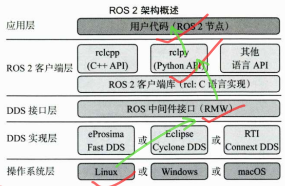

# ROS2机器人开发从入门到实践

## 1、启程---让你的第一个机器人动起来

### 1.1 ROS部落的自我介绍
#### 1.1.1 机器人和ROS
ROS在机器人中的作用就是将传感器的数据发送给决策系统，然后将决策系统的输出发送给执行器执行。 
ROS本质上就是快速搭建机器人的软件库（核心是通信集）和工具集；ROS1在通信上缺乏稳定性、实时性和安全性等问题，因此ROS2登上舞台（ROS2采用第三方的通信组件代替ROS1中的通信组件）。

#### 1.1.2 ROS2系统架构
ROS2系统架构分为以下5层：操作系统层（Linux，为ROS2提供各种基础的硬件驱动）、DDS（数据分发服务，基于实时发布订阅协议RTSP来实现数据的分发，也就是第三方的通信组件）实现层、DDS接口层（定义了RMW，由不同DDS进行实现，为ROS2客户端层提供统一的调用接口）、ROS2客户端层（提供了不同编程语言的ROS2客户端库RCL，使用这些库提供的接口，可以完成对ROS2核心功能的调用）和应用层（所有基于RCL开发的程序都属于应用层）。

#### 1.1.3 ROS2机器人开发特色
1、四大核心通信机制 
话题（Topic）通信：指的是一种发布-订阅通信模式，即发布者将信息发布到某个话题上，订阅者订阅话题即可获取数据，数据是单向传递的。 
服务（Service）通信：是双向的，可以分为服务端和客户端，客户端可以发送请求到服务端，由服务端处理并返回结果。 
参数（Parameter）通信:主要用于机器人参数设置和读取。 
动作（Action）通信:同样分为动作客户端和动作服务端，但动作服务端在处理客户端请求时可以反馈处理进度并可以随时取消，因此往往用于复杂的机器人行为。 

2、丰富的调试工具 
用于三维可视化的RViz；用于可视化图表、图像等数据的rqt系列工具；用于数据记录和回访的ros2 bag工具。 

3、建模和运动学工具 
提供了机器人开发中常用于运动学坐标转换与管理的TF工具，同时定义了描述机器人的结构、关节、传感器等信息的文件格式URDF。 

4、强大的开源社区及应用框架 
强大的可仿真工具Gazebo、用于移动机器人导航的Navigation应用框架和用于机械臂运动规划的Moveit2应用框架。 
### 1.2 开发环境搭建
1、下载和安装虚拟机VMware 

2、下载Linux系统镜像：ubuntu-22.04.5-desktop-amd64.iso 
https://mirrors.tuna.tsinghua.edu.cn/ubuntu-releases/ 

3、在虚拟机中安装Ubuntu 22.04 
https://blog.csdn.net/weixin_52799373/article/details/139055794 
https://blog.csdn.net/breakaway_01/article/details/141285020 

4、安装ROS 2 
https://blog.csdn.net/weixin_55944949/article/details/140373710 
https://blog.csdn.net/qq_44339029/article/details/120579608 

### 1.3 运行你的第一个机器人
#### 1.3.1 启动海龟模拟器
运行海龟模拟器节点： 
终端命令：ros2 run turtlesim turtlesim_node 
ros2 run : 表示使用ros2运行程序；turtlesim ：一个程序包的名称，其下面包含多个可执行程序，turtlesim_node就是其中之一。  

启动海龟键盘控制程序：ros2 run turtlesim turtle_teleop_key  

简单分析：通过ROS2提供的节点关系图工具可以快速查看联系（打开rqt工具的命令：rqt） 
接着在rqt工具栏选择Plugins→Introspection→NodeGraph选项，打开后单击左上角的刷新按钮，获取当前系统最新的节点关系。 
/turtulel/cmd_vel就是话题名称，这条线的起点(键盘控制节点)就是话题的发布者，终点(海龟节点)就是话题的订阅者，所以海龟节点和键盘控制节点就是通过四大通信机制之一的话题通信进行连接的。 
### 1.4 ROS2基础之Linux

#### 1.4.1 linux终端基础操作
Ctrl+Alt+T键 :打开一个新的终端  
pwd命令 :查看当前终端所在目录  
cd /  :从当前进入根目录(~代替主目录)  
ls :查看当前目录下的文件  
mkdir chapt1  :在主目录下创建chapt1文件夹  
touch hello.txt  :创建空白文件  
使用cat命令查看文件内容，使用rm命令删除文件  
在命令后加上--help，直接运行即可查看帮助信息  

#### 1.4.2 linux基础之环境变量
查看当前终端配置的ROS版本：echo $ROS_DISRTO      ===> humble 
前面我们使用 ros2 run运行 turtlesim程序包下的turtlesim_node时，ros2 run会先读取环境变量AMENT_PREFIX_PATH的值，然后到该环境变量下的lib目录内查找功能包和可执行文件。 
echo $AMENT_PREFIX_PATH    ===>  /opt/ros/humble 
### 1.5 小结与点评
对ROS22有了简单地认识，并成功地搭建了虚拟机和ROS2开发环境。接着通过海龟模拟器对ROS2的通信机制和调试工具有了一定的了解。 

## 2、ROS2基础入门---从第一个节点开始

### 2.1 编写你的第一个节点

### 2.2 使用功能包组织python节点

### 2.3 多功能包的最佳实践Workspace

### 2.4 ROS2基础编程

### 2.5 小结与点评

## 3、订阅和发布---话题通信探索

### 3.1 话题通信介绍

### 3.2 python话题订阅与发布

### 3.3 话题通信最佳实践

### 3.4 ROS2基础之git入门

### 3.5 小结与点评