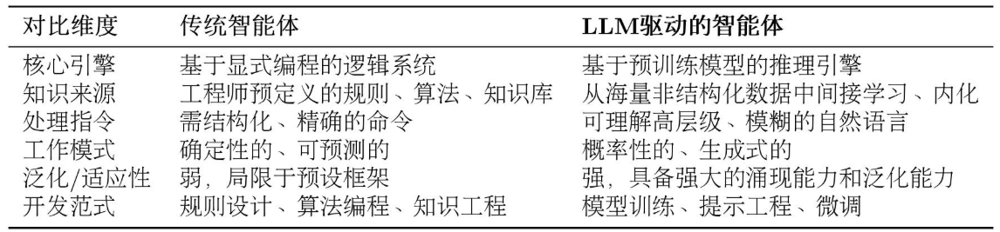
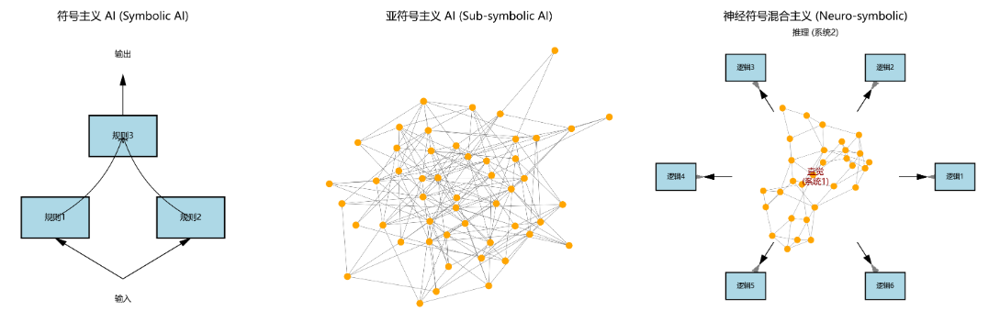

# 项目介绍
技术焦点正从训练更大的基础模型，转向构建更聪明的智能体应用。 
Hello_Agents项目，是Datawhale 社区的系统性智能体学习教程，为社区提供一本从零开始、理论与实战并重的智能体系统构建指南。 
如今 Agent 构建主要分为两派，一派是 Dify，Coze，n8n 这类软件工程类 Agent，其本质是流程驱动的软件开发，LLM 作为数据处理的后端；另一派则是 AI 原生的 Agent，即真正以 AI 驱动的 Agent。 

# 前言
智能体---让 AI 不仅仅是一个“有问必答”的工具，而是成为一个能自主规划、调用工具、解决复杂问题的“行动者”。 
单个智能体已经能胜任特定领域的任务，而由多个智能体分工、协作、甚至辩论，共同完成一个宏大目标的多智能体系统（Multi-Agent System, MAS），则被视为释放 LLM 全部潜能、解决真实世界复杂问题的关键钥匙。 

# 智能体与语言模型基础

## 第一章 初识智能体
### 什么是智能体
在人工智能领域，智能体被定义为任何能够通过传感器（Sensors）感知其所处环境（Environment），并自主地通过执行器（Actuators）采取行动（Action）以达成特定目标的实体。 
这个定义包含了智能体存在的四个基本要素： 
（1）环境：环境是智能体所处的外部世界。对于自动驾驶汽车，环境是动态变化的道路交通；对于一个交易算法，环境则是瞬息万变的金融市场。智能体并非与环境隔离，它通过其传感器持续地感知环境状态。 
（2）传感器：摄像头、麦克风、雷达或各类应用程序编程接口（Application Programming Interface, API）返回的数据流，都是其感知能力的延伸。 

（3）执行器：获取信息后，智能体需要采取行动来对环境施加影响，它通过执行器来改变环境的状态。执行器可以是物理设备（如机械臂、方向盘）或虚拟工具（如执行一段代码、调用一个服务）。 

（4）行动：然而，真正赋予智能体"智能"的，是其自主性（Autonomy）。智能体并非只是被动响应外部刺激或严格执行预设指令的程序，它能够基于其感知和内部状态进行独立决策，以达成其设计目标。这种从感知到行动的闭环，构成了所有智能体行为的基础。 

#### 传统视角下的智能体
起点：①反射智能体。 
决策核心由工程师明确设计的“条件-动作”规则构成。经典的自动恒温器便是如此：若传感器感知的室温高于设定值，则启动制冷系统。这种智能体完全依赖于当前的感知输入，不具备记忆或预测能力。 

发展：②基于模型的反射智能体（Model-Based Reflex Agent）。 
这类智能体拥有一个内部的世界模型（World Model），用于追踪和理解环境中那些无法被直接感知的方面。它试图回答：“世界现在是什么样子的？”。例如，一辆在隧道中行驶的自动驾驶汽车，即便摄像头暂时无法感知到前方的车辆，它的内部模型依然会维持对那辆车存在、速度和预估位置的判断。这个内部模型让智能体拥有了初级的“记忆”，使其决策不再仅仅依赖于瞬时感知，而是基于一个更连贯、更完整的世界状态理解。 

发展：③基于目标的智能体（Goal-Based Agent）的发展。 
主动地、有预见性地选择能够导向某个特定未来状态的行动。这类智能体需要回答的问题是：“我应该做什么才能达成目标？”。经典的例子是 GPS 导航系统：你的目标是到达公司，智能体会基于地图数据（世界模型），通过搜索算法（如 A*算法）来规划（Planning）出一条最优路径。这类智能体的核心能力体现在了对未来的考量与规划上。 

发展：④当多个目标需要权衡时，基于效用的智能体（Utility-Based Agent）便随之出现。 
它为每一个可能的世界状态都赋予一个效用值，这个值代表了满意度的高低。智能体的核心目标不再是简单地达成某个特定状态，而是最大化期望效用。它需要回答一个更复杂的问题：“哪种行为能为我带来最满意的结果？”。这种架构让智能体学会在相互冲突的目标之间进行权衡，使其决策更接近人类的理性选择。 

以上四个的核心决策逻辑，无论是规则、模型还是效用函数，依然依赖于人类设计师的先验知识。 

发展：⑤学习型智能体（Learning Agent）的核心思想是不依赖预设，而是通过与环境的互动自主学习。 
而强化学习（Reinforcement Learning, RL）是实现这一思想最具代表性的路径。一个学习型智能体包含一个性能元件（即我们前面讨论的各类智能体）和一个学习元件。学习元件通过观察性能元件在环境中的行动所带来的结果来不断修正性能元件的决策策略。 

想象一个学习下棋的 AI。它开始时可能只是随机落子，当它最终赢下一局时，系统会给予它一个正向的奖励。通过大量的自我对弈，学习元件会逐渐发现哪些棋路更有可能导向最终的胜利。AlphaGo Zero 是这一理念的一个里程碑式的成就。它在围棋这一复杂博弈中，通过强化学习发现了许多超越人类既有知识的有效策略。 

#### 大语言模型驱动的新范式
由大语言模型驱动的 LLM 智能体，其核心决策机制与传统智能体存在本质区别，从而赋予了其一系列全新的特性。 
简而言之，传统智能体的能力源于工程师的显式编程与知识构建，其行为模式是确定且有边界的；而 LLM 智能体则通过在海量数据上的预训练，获得了隐式的世界模型与强大的涌现能力，使其能够以更灵活、更通用的方式应对复杂任务。 
 
这种差异使得 LLM 智能体可以直接处理高层级、模糊且充满上下文信息的自然语言指令。 
让我们以一个“智能旅行助手”为例来说明。 

在 LLM 智能体出现之前，规划旅行通常意味着用户需要在多个专用应用（如天气、地图、预订网站）之间手动切换，并由用户自己扮演信息整合与决策的角色。而一个 LLM 智能体则能将这个流程整合起来。当接收到“规划一次厦门之旅”这样的模糊指令时，它的工作方式体现了以下几点： 

规划与推理：智能体首先会将这个高层级目标分解为一系列逻辑子任务，例如：[确认出行偏好] -> [查询目的地信息] -> [制定行程草案] -> [预订票务住宿]。这是一个内在的、由模型驱动的规划过程。 
工具使用：在执行规划时，智能体识别到信息缺口，会主动调用外部工具来补全。例如，它会调用天气查询接口获取实时天气，并基于“预报有雨”这一信息，在后续规划中倾向于推荐室内活动。 
动态修正：在交互过程中，智能体会将用户的反馈（如“这家酒店超出预算”）视为新的约束，并据此调整后续的行动，重新搜索并推荐符合新要求的选项。整个“查天气 → 调行程 → 订酒店”的流程，展现了其根据上下文动态修正自身行为的能力。 
总而言之，我们正从开发专用自动化工具转向构建能自主解决问题的系统。核心不再是编写代码，而是引导一个通用的“大脑”去规划、行动和学习。 

#### 智能体的类型

（1）基于内部决策架构的分类 

第一种分类维度是依据智能体内部决策架构的复杂程度，这个视角在《Artificial Intelligence: A Modern Approach》中系统性地提出。传统智能体的演进路径本身就构成了最经典的分类阶梯，它涵盖了从简单的反应式智能体，到引入内部模型的模型式智能体，再到更具前瞻性的基于目标和基于效用的智能体。此外，学习能力则是一种可赋予上述所有类型的元能力，使其能通过经验自我改进。 

（2）基于时间与反应性的分类 

除了内部架构的复杂性，还可以从智能体处理决策的时间维度进行分类。这个视角关注智能体是在接收到信息后立即行动，还是会经过深思熟虑的规划再行动。这揭示了智能体设计中一个核心权衡：追求速度的反应性（Reactivity）与追求最优解的规划性（Deliberation）之间的平衡。 

①反应式智能体 (Reactive Agents) 
这类智能体对环境刺激做出近乎即时的响应，决策延迟极低。它们通常遵循从感知到行动的直接映射，不进行或只进行极少的未来规划。上文的简单反应式和基于模型的智能体都属于此类别。 

其核心优势在于速度快、计算开销低，这在需要快速决策的动态环境中至关重要。例如，车辆的安全气囊系统必须在碰撞发生的毫秒内做出反应，任何延迟都可能导致严重后果；同样，高频交易机器人也必须依赖反应式决策来捕捉稍纵即逝的市场机会。然而，这种速度的代价是“短视”，由于缺乏长远规划，反应式智能体容易陷入局部最优，难以完成需要多步骤协调的复杂任务。 

②规划式智能体(Deliberative Agents) 
与反应式智能体相对，规划式（或称审议式）智能体在行动前会进行复杂的思考和规划。它们不会立即对感知做出反应，而是会先利用其内部的世界模型，系统地探索未来的各种可能性，评估不同行动序列的后果，以期找到一条能够达成目标的最佳路径 。基于目标和基于效用的智能体是典型的规划式智能体。 

可以将其决策过程类比为一位棋手。他不会只看眼前的一步，而是会预想对手可能的应对，并规划出后续几步甚至十几步的棋路。这种深思熟虑的能力使其能够处理复杂的、需要长远眼光的任务，例如制定一份商业计划或规划一次长途旅行。它们的优势在于决策的战略性和远见。然而，这种优势的另一面是高昂的时间和计算成本。在瞬息万变的环境中，当规划式智能体还在深思熟虑时，采取行动的最佳时机可能早已过去。 

③混合式智能体(Hybrid Agents) 
现实世界的复杂任务，往往既需要即时反应，也需要长远规划。例如，我们之前提到的智能旅行助手，既要能根据用户的即时反馈（如“这家酒店太贵了”）调整推荐（反应性），又要能规划出为期数天的完整旅行方案（规划性）。因此，混合式智能体应运而生，它旨在结合两者的优点，实现反应与规划的平衡。 

一种经典的混合架构是分层设计：底层是一个快速的反应模块，处理紧急情况和基本动作；高层则是一个审慎的规划模块，负责制定长远目标。而现代的 LLM 智能体，则展现了一种更灵活的混合模式。它们通常在一个“思考-行动-观察”的循环中运作，巧妙地将两种模式融为一体： 

·规划(Reasoning) ：在“思考”阶段，LLM 分析当前状况，规划出下一步的合理行动。这是一个审议过程。 
·反应(Acting & Observing) ：在“行动”和“观察”阶段，智能体与外部工具或环境交互，并立即获得反馈。这是一个反应过程。 
通过这种方式，智能体将一个需要长远规划的宏大任务，分解为一系列“规划-反应”的微循环。这使其既能灵活应对环境的即时变化，又能通过连贯的步骤，最终完成复杂的长期目标。 

（3）基于知识表示的分类 

这是一个更根本的分类维度，它探究智能体用以决策的知识，究竟是以何种形式存于其“思想”之中。这个问题是人工智能领域一场持续半个多世纪的辩论核心，并塑造了两种截然不同的 AI 文化。 

①符号主义 AI（Symbolic AI） 
符号主义，常被称为传统人工智能，其核心信念是：智能源于对符号的逻辑操作。这里的符号是人类可读的实体（如词语、概念），操作则遵循严格的逻辑规则。这好比一位一丝不苟的图书管理员，将世界知识整理为清晰的规则库和知识图谱。 

其主要优势在于透明和可解释。由于推理步骤明确，其决策过程可以被完整追溯，这在金融、医疗等高风险领域至关重要。然而，其“阿喀琉斯之踵”在于脆弱性：它依赖于一个完备的规则体系，但在充满模糊和例外的现实世界中，任何未被覆盖的新情况都可能导致系统失灵，这就是所谓的“知识获取瓶颈”。 

②亚符号主义 AI（Sub-symbolic AI） 
亚符号主义，或称连接主义，则提供了一幅截然不同的图景。在这里，知识并非显式的规则，而是内隐地分布在一个由大量神经元组成的复杂网络中，是从海量数据中学习到的统计模式。神经网络和深度学习是其代表。 

如果说符号主义 AI 是图书管理员，那么亚符号主义 AI 就像一个牙牙学语的孩童 。他不是通过学习“猫有四条腿、毛茸茸、会喵喵叫”这样的规则来认识猫的，而是在看过成千上万张猫的图片后，大脑中的神经网络能辨识出“猫”这个概念的视觉模式。这种方法的强大之处在于其模式识别能力和对噪声数据的鲁棒性。它能够轻松处理图像、声音等非结构化数据，这在符号主义 AI 看来是极其困难的任务。 

然而，这种强大的直觉能力也伴随着不透明性。亚符号主义系统通常被视为一个黑箱（Black Box）。它能以惊人的准确率识别出图片中的猫，但你若问它“为什么你认为这是猫？”，它很可能无法给出一个合乎逻辑的解释。此外，它在纯粹的逻辑推理任务上表现不佳，有时会产生看似合理却事实错误的幻觉 。 

③神经符号主义 AI（Neuro-Symbolic AI） 
长久以来，符号主义和亚符号主义这两大阵营如同两条平行线，各自发展。为克服上述两种范式的局限，一种“大和解”的思想开始兴起，这就是神经符号主义 AI，也称神经符号混合主义。它的目标，是融合两大范式的优点，创造出一个既能像神经网络一样从数据中学习，又能像符号系统一样进行逻辑推理的混合智能体。它试图弥合感知与认知、直觉与理性之间的鸿沟。诺贝尔经济学奖得主丹尼尔·卡尼曼（Daniel Kahneman）在其著作《思考，快与慢》中提出的双系统理论，为我们理解神经符号主义提供了一个绝佳的类比： 

·系统 1是缓慢、有条理、基于逻辑的审慎思维，恰如符号主义 AI 的推理过程。 
·系统 2是快速、凭直觉、并行的思维模式，类似于亚符号主义 AI 强大的模式识别能力。 

 

人类的智能，正源于这两个系统的协同工作。同样，一个真正鲁棒的 AI，也需要兼具二者之长。大语言模型驱动的智能体是神经符号主义的一个极佳实践范例。其内核是一个巨大的神经网络，使其具备模式识别和语言生成能力。然而，当它工作时，它会生成一系列结构化的中间步骤，如思想、计划或 API 调用，这些都是明确的、可操作的符号。通过这种方式，它实现了感知与认知、直觉与理性的初步融合。 

### 智能体的构成与运行原理
